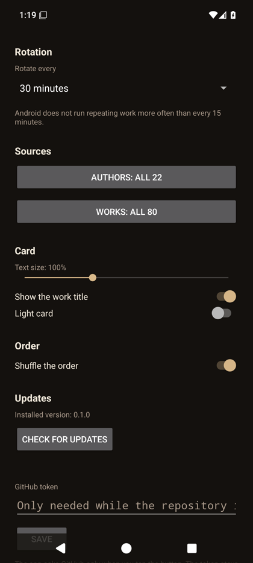
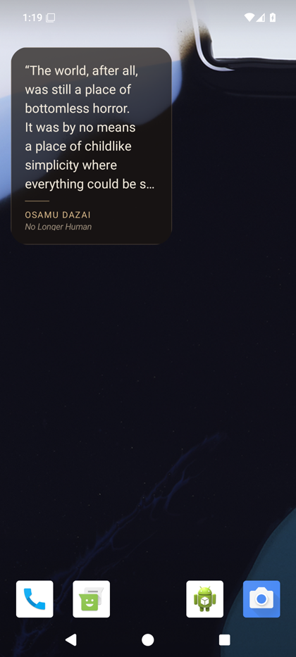

# quotes

An Android app and home screen widget that puts one line from a classic book on
your phone: Dostoevsky, Murakami, Mishima, Dazai, Kafka, Camus, Rilke, Marcus
Aurelius, Woolf, Baldwin and others. Lines about staying alive, keeping on, and
getting through the day.

The card is set in EB Garamond, which ships inside the APK. It shows the quote,
the author in letterspaced capitals, and the work in italics. Tap the quote for
the next one; tap the attribution to open the app.

<p>
  
  
  
</p>

The app asks for the internet permission for one thing only: the update check.
Nothing else uses the network, no check runs in the background, and the corpus is
compiled into the APK, so the widget works with the phone offline.

## Build and install

```sh
nix-shell                      # Android SDK, build tools, emulator, Gradle, JDK 21
cd android
gradle assembleDebug \
  -Pandroid.aapt2FromMavenOverride=$ANDROID_HOME/build-tools/36.0.0/aapt2
adb install -r app/build/outputs/apk/debug/app-debug.apk
```

The `-P` flag is required on NixOS. AGP downloads its own `aapt2` from Google
Maven and runs it as a daemon; that binary is built for a generic Linux and
cannot start here. The flag points AGP at the `aapt2` from the SDK. A line in
`local.properties` does not work: AGP reads that setting only from a Gradle
property.

`shell.nix` composes the SDK from nixpkgs. It needs
`android_sdk.accept_license = true`, which the file sets.

## The widget

- **Add it**: open the app and tap *Add widget*, or long-press the home screen,
  open *Widgets*, and pick *Quote of the moment*.
- **Size**: the card adapts to the cell you give it. A small cell drops to
  smaller text, fewer lines, and no rule, so the author stays on the card. A tall
  cell takes larger text and more lines. A quote too long for the cell is cut
  with an ellipsis.
- **Tap the quote**: show the next quote.
- **Tap the author**: open the app.
- **Rotation**: every 15, 30, 60, 120 or 240 minutes, or never. An inexact alarm
  drives it, so the system may delay an update a little to save power. Android
  does not fire repeating alarms more often than 15 minutes; a smaller number is
  clamped.

## Settings

Every change applies at once, to the card in the app and to every placed widget.
There is no Apply button.

| Setting | Effect |
| --- | --- |
| Rotate every | `Never, only when I tap`, or 15, 30, 60, 120 or 240 minutes |
| Authors | pick the authors to draw from. Empty means all of them |
| Works | pick the works to draw from. Empty means all of them |
| Text size | 80 to 140 percent, on top of the size the widget was given |
| Show the work title | hide the work line for a plainer card |
| Light card | a cream card with dark text, for a light home screen |
| Shuffle the order | off walks the corpus in order |

A selection that leaves nothing falls back to the whole corpus, so the widget can
never come up empty.

## Updates

The app installs from this repository, not from a store, so it updates itself
from the GitHub releases:

1. Open *Settings* and find the *Updates* section. It names the installed
   version.
2. Tap *Check for updates*. The app asks GitHub for the latest release and
   compares the two versions.
3. If a later release exists, tap *Download and install*. The APK lands in the
   app cache, and the system installer asks for your confirmation.

The repository is private, so the GitHub API needs a token. Paste a fine-grained
token with read access to the releases into the *GitHub token* field and tap
*Save*. Without a token the check reports that GitHub has no release, because a
private repository answers `404` to an anonymous request. The token stays on the
phone. If the repository becomes public, the field can stay empty.

The APK is debug signed, so Android accepts an update only while the releases
come from the same signing key. Build future releases on this machine, or move
`~/.android/debug.keystore` with the project. If the keys differ, Android
refuses the update, and the app explains that the installed copy must be removed
first.

## The corpus

`data/quotes.json` is the single source of truth:

```json
{
  "author": "Fyodor Dostoevsky",
  "work": "The Brothers Karamazov",
  "text": "For the mystery of human existence lies not in just staying alive but in finding something to live for.",
  "source": "https://en.wikiquote.org/wiki/Fyodor_Dostoyevsky"
}
```

The rule for this repository: every `text` value comes from the English
Wikiquote page named in `source`, character for character. No quote is written
from memory, and no quote is paraphrased. `work` names the book, story or essay,
and is `null` when Wikiquote gives none.

Three checks hold that rule:

```sh
nix run nixpkgs#python3 -- tools/check-corpus.py      # shape, duplicates, counts
nix run nixpkgs#python3 -- tools/verify-grounding.py  # fetches every source page
cd android && gradle copyCorpus                       # the build-time gate
```

The Gradle task `copyCorpus` copies the corpus into the APK assets and fails the
build when a quote misses a key, when a text falls outside 40 to 400 characters,
when a source is not a Wikiquote URL, or when the corpus drops below 40 quotes.

## Layout

```
data/quotes.json                  the corpus
tools/check-corpus.py             offline validation
tools/verify-grounding.py         proves each quote is on its source page
android/                          the app and the widget
shell.nix                         the Android toolchain from nixpkgs
```

The typeface is EB Garamond by Georg Duffner and Octavio Pardo, used under the
SIL Open Font License 1.1.
